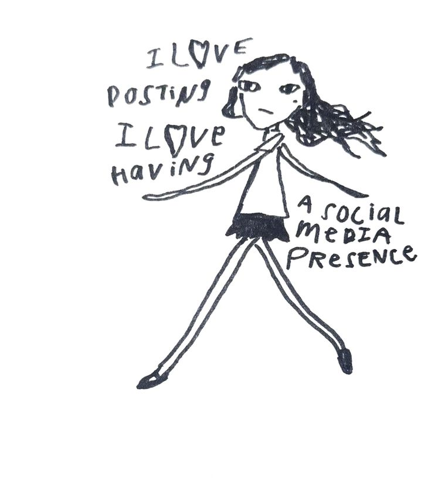

## june 23 | 2026

> (Lili) Alice Carolina
>
> | 17, nb & qualquer pronome | estudante & artista |

Escrever sobre mim para as pessoas me parece algo meio estranho. No momento que decidi ter um blog eu tive noção de que falar sobre o que eu penso é expor uma parte íntima de mim. Dificilmente eu falo sobre pensamentos reais que eu possuo no dia-a-dia e estar compartilhando isso tem uma sensação levemente aliviadora.. fiquem com uma breve descrição da minha pessoa logo em seguida.

---

Oiê, me chamo alice! Tenho 17 anos e estou no 3 ano do ensino médio. Sou uma pessoa não-binário sem preferência de pronome. Entrei na internet por volta dos meus 7 anos e hoje aos 17 cumpri o desejo de ser uma adolecente que faz coisinhas relativamente legais!!!!1

Tenho um certo fundo em arte pois cresci amando desenhar e pintar (exceto a parte teórica, arranque um braço e uma perna minha mas não me peça para explicar conceitos). Sempre gostei dos diversos tipos de forma de expressão, seja ela uma mudança na aparência ou parte dos seus gostos.

Futuramente espero mesmo cursar alguma coisa que eu idealizo, como ciências da computação, jornalismo, moda, artes visuais, arquitetura e desenvolvimento sustentável... algo que envolva um certo processo artistico criativo, apesar de na verdade não querer ir para uma universidade e sim uma escola de artes.

---

## • Eu como identidade:

Sinceramente, criar uma lista é uma forma burra de tentar descrever tudo que eu gosto (sim, eu tentei) então eu tentarei falar um pouquinho das coisas que eu gosto.

Como hobby eu adoro desenhar, escrever, fotografia, pintura e trabalhos manuais (diy). Passo a maior parte do meu dia ouvindo música no spotify ou youtube, mas deixarei para citar sobre gêneros, artistas e músicas favoritas em outro dia. Falando em gênero, terror psicológico com certeza é um dos melhores para jogos e livros! Indo agora para sub-culturas, sempre absolutamente adorei olhar revistas de moda e posts sobre moda alternativa e como as pessoas criam suas personalidades únicas baseadas em movimentos políticos (ou por pura estética também/quebra de um padrão normalizado pela sociedade).

 Obviamente tudo que eu amo e cada partezinha de mim nunca vai caber em um simples lugar, mas de pouco tentarei tornar esse blog em um espaço dedicado a mim e minhas ideias. Considerando você essa introdução curta ou longa, estaremos finalizando por aqui! Muito obrigado(a) a quem leu e está disposto a acompanhar minhas bobeiras. :D

 